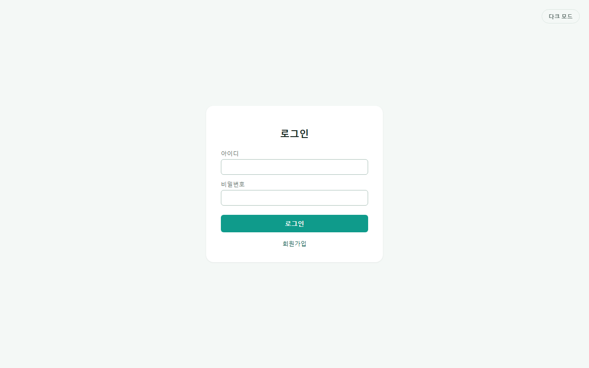
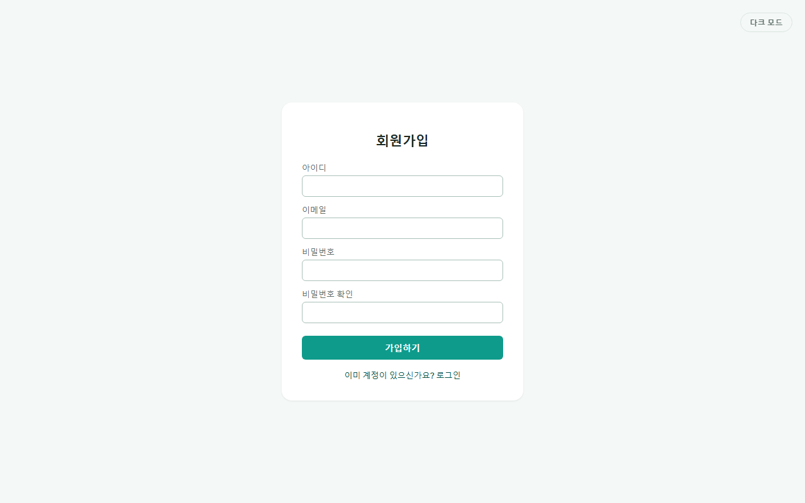
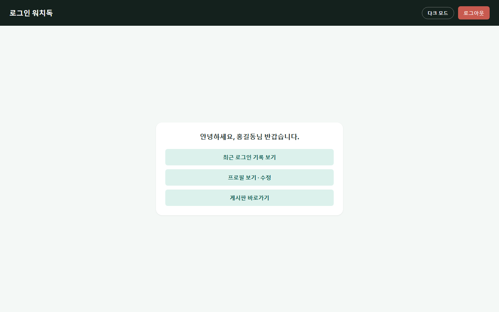
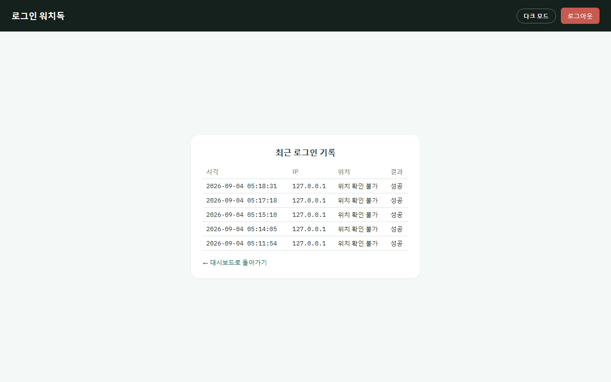
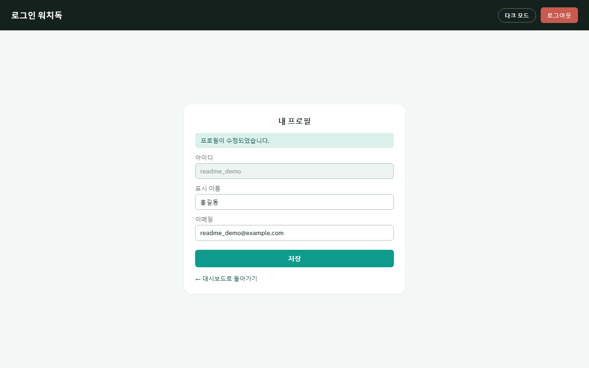
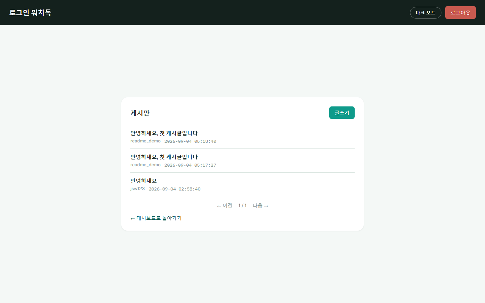
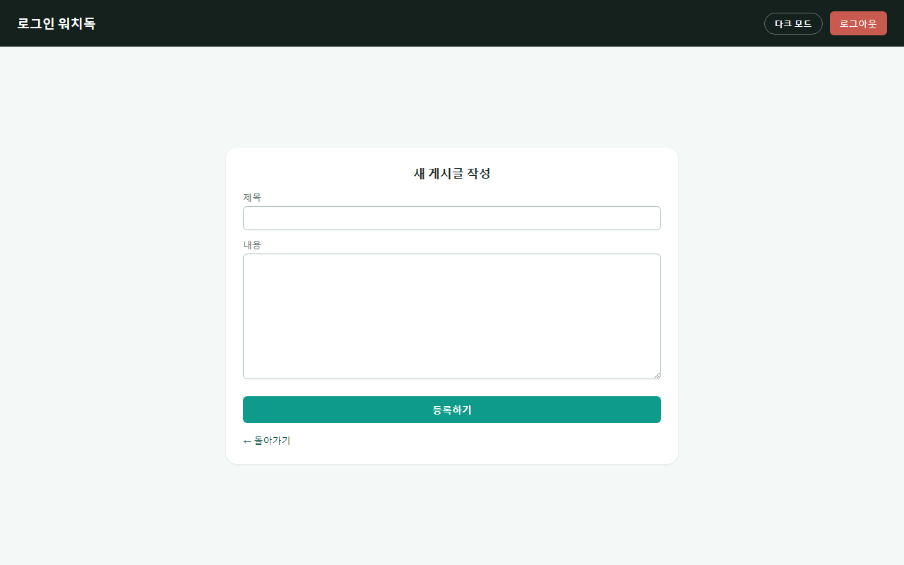
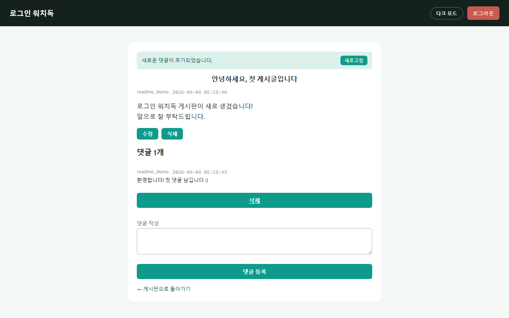

# 로그인 워치독 (login-watchdog)

같은 IP에서 짧은 시간 안에 로그인을 반복해서 틀리면 자동으로 감지해 IP를 잠그고, Slack으로 알림을 보내고, 관리자가 대시보드에서 실시간으로 확인·해제할 수 있는 브루트포스 방어 데모 프로젝트입니다.

**배포 주소**: https://login-watchdog.vercel.app (Vercel — 회원가입/로그인/관리자 대시보드까지 실제 스모크 테스트로 검증됨)

## 주요 기능

- **회원가입 / 로그인** — Supabase에 저장된 실제 계정으로 로그인하는 감시 대상 화면 (`/signup`, `/login`)
- **브루트포스 탐지 + 자동 잠금** — 같은 IP가 60초 안에 5회 초과 로그인 실패 시 해당 IP를 5분간 자동 잠금
- **Slack 알림** — 잠금이 발생하는 순간 Slack 채널에 시각·IP·실패 횟수·조치 내용을 전송 (웹훅 미설정 시 콘솔 로그로 자동 대체)
- **회원 대시보드** (`/dashboard`) — 로그인한 회원 본인의 인사말 화면. 최근 로그인 기록(접속 국가/도시 포함) 조회, 표시 이름·이메일 프로필 수정 가능
- **관리자 대시보드** (`/admin/dashboard`) — 세션 로그인으로 보호되는 별도 화면에서 최근 로그인 시도(접속 위치 포함), 현재 잠긴 IP, 등록된 회원 목록(삭제 가능), 회원가입 On/Off, 관리자 로그인 기록을 실시간(폴링) 확인 + "즉시 해제" 버튼으로 수동 잠금 해제
- **IP 위치 조회** — [ip-api.com](https://ip-api.com)으로 접속 IP의 국가·도시를 조회해 회원/관리자 대시보드에 표시. 조회 결과는 Supabase(`ip_locations`)에 캐시되어 같은 IP를 반복 조회하지 않음(무료 API의 분당 45건 한도 대응)
- **게시판·댓글** (`/board`) — 로그인한 회원 전용 게시판. 글 작성/수정/삭제(본인 글만), 댓글 작성/삭제(본인 댓글만), 페이지 번호 방식 목록, 새 댓글이 달리면 알림 배너 표시. 관리자 대시보드에서는 별도로 전체 게시글·댓글을 조회·삭제 가능. 자세한 설계 배경은 [docs/board-comment/](docs/board-comment) 참고

## 기술 스택

| 영역 | 사용 기술 |
|---|---|
| 백엔드 | Flask (단일 `app.py`, Blueprint 미사용) |
| 데이터베이스 | Supabase (PostgreSQL) |
| 알림 | Slack Incoming Webhook |
| 인증 | Flask 세션 + `werkzeug.security` (비밀번호 해시) |
| 프런트엔드 | Jinja2 템플릿 + 바닐라 JS |
| 테스트 | pytest |

## 시작하기 (Getting Started)

### 1. 저장소 클론
```bash
git clone https://github.com/dyj02056/login-watchdog.git
cd login-watchdog
```

### 2. 가상환경 생성 및 패키지 설치
```bash
python -m venv venv
source venv/Scripts/activate   # Windows PowerShell: .\venv\Scripts\Activate.ps1
pip install -r requirements.txt
```

### 3. Supabase 프로젝트 준비
1. [supabase.com](https://supabase.com)에서 프로젝트 생성
2. **SQL Editor**에서 [docs/schema.sql](docs/schema.sql) 내용 전체 실행 (`users`, `login_attempts`, `lockouts`, `admin_users`, `admin_login_log`, `app_settings`, `ip_locations`, `signup_attempts`, `posts`, `comments`, `post_attempts`, `comment_attempts` 12개 테이블 생성)
3. **Project Settings → API**에서 `Project URL`과 `service_role` key 확인

### 4. 환경변수 설정
`.env.example`을 복사해 `.env`를 만들고 아래 값을 채웁니다. (`.env`는 `.gitignore`로 보호되어 커밋되지 않습니다.)

```bash
cp .env.example .env
```

| 키 | 설명 |
|---|---|
| `SUPABASE_URL` | Supabase 프로젝트 루트 주소 (`https://xxxx.supabase.co`, 끝에 `/rest/v1/` 등 경로를 붙이지 않음) |
| `SUPABASE_KEY` | `service_role` key (서버 전용, 절대 노출 금지) |
| `SLACK_WEBHOOK_URL` | Slack Incoming Webhook 주소. 비워두면 알림이 콘솔 로그로 대체됨 |
| `SECRET_KEY` | Flask 세션 쿠키 서명용 임의 문자열 (예: `python -c "import secrets; print(secrets.token_hex(32))"`) |
| `ADMIN_USERNAME` / `ADMIN_PASSWORD` | 서버 최초 기동 시 자동 생성될 관리자 계정 (이미 계정이 있으면 무시됨) |
| `TRUST_FORWARDED_FOR` | `X-Forwarded-For` 헤더 신뢰 여부. **데모/시연 전용, 운영에서는 반드시 `false`** |

### 5. 서버 실행
```bash
python app.py
```
기본적으로 `http://localhost:5000`에서 실행됩니다. 해당 포트가 이미 사용 중이면 `PORT` 환경변수로 다른 포트를 지정할 수 있습니다(`PORT=5050 python app.py`).

### 6. 접속 주소

| 주소 | 설명 |
|---|---|
| `/signup` | 회원가입 (감시 대상 계정 생성) |
| `/login` | 감시 대상 로그인 — 이 화면에서의 실패 시도가 탐지 대상. 로그인 성공 시 `/dashboard`로 이동 |
| `/dashboard` | 회원 대시보드 — 인사말, 로그인 기록·프로필 조회/수정 (회원 로그인 필요) |
| `/admin/login` | 관리자 로그인 |
| `/admin/dashboard` | 관리자 대시보드 — 잠긴 IP·회원 관리·회원가입 On/Off·게시판 관리 (관리자 로그인 필요) |
| `/board` | 게시판 목록 (회원 로그인 필요) |
| `/board/new` | 새 게시글 작성 (회원 로그인 필요) |
| `/board/<id>` | 게시글 상세 · 댓글 (회원 로그인 필요) |

## 화면 미리보기

### 인증

<table>
<tr>
<td align="center"><b>로그인</b><br>(관리자 로그인 <code>/admin/login</code>도 동일 화면 공유)</td>
<td align="center"><b>회원가입</b></td>
</tr>
<tr>
<td></td>
<td></td>
</tr>
</table>

### 회원 대시보드

<table>
<tr>
<td align="center"><b>대시보드</b></td>
<td align="center"><b>로그인 기록</b></td>
<td align="center"><b>프로필</b></td>
</tr>
<tr>
<td></td>
<td></td>
<td></td>
</tr>
</table>

### 게시판

<table>
<tr>
<td align="center"><b>목록</b></td>
<td align="center"><b>글쓰기</b></td>
<td align="center"><b>상세 · 댓글</b></td>
</tr>
<tr>
<td></td>
<td></td>
<td></td>
</tr>
</table>

> 관리자 대시보드(`/admin/dashboard`) 스크린샷은 실제 접속 로그(IP·위치 등 민감 정보)가 노출되어 이 문서에는 포함하지 않았습니다.

## 테스트 실행

```bash
pytest tests/
```
실제 Supabase에 접속하지 않고 가짜 데이터(monkeypatch)로 판정 로직만 검증하므로 몇 초 안에 끝납니다.

## 프로젝트 구조

```
login-watchdog/
├── app.py              # Flask 진입점 — 라우트, 세션, 로그인 흐름
├── db.py                # Supabase 연동 (읽기/쓰기 전담)
├── detector.py           # 브루트포스 판정 로직
├── soar.py                # 판정 결과에 따른 조치(잠금/해제) 실행
├── alert.py                # Slack 알림 전송
├── geoip.py                  # IP 위치(국가·도시) 조회, 캐싱
├── config.py                   # 임계값·윈도우·잠금시간 등 상수
├── templates/                   # Jinja2 HTML 템플릿
├── public/css, public/js         # 스타일 및 대시보드 자바스크립트
├── tests/                          # pytest 단위 테스트
├── docs/schema.sql                  # Supabase 테이블 정의
├── docs/beginner-guide/               # 비전공자용 단계별 구현 해설서 (20개 파일로 분리)
├── docs/board-comment/                  # 게시판·댓글 기능 설계 문서(분석 → 결정 → 계획 → 결과)
└── plan.md, research.md                # 설계 근거 문서
```

## 더 자세히 알고 싶다면

- [plan.md](plan.md) — 각 파일을 왜 이렇게 설계했는지에 대한 상세 근거
- [docs/beginner-guide/beginner-guide.md](docs/beginner-guide/beginner-guide.md) — 개발 지식이 없어도 이해할 수 있도록 각 구현 단계를 코드와 함께 풀어쓴 해설서. 단계별로 `guide01_setup.md` ~ `guide20_board.md` 파일로 나뉘어 있고, 이 파일 안의 목차에서 바로 이동할 수 있습니다.
- [docs/board-comment/](docs/board-comment) — 게시판·댓글 기능을 왜 이렇게 설계했는지(구현 전 분석 → 모호한 질문 11개 결정 → 구현 계획 → 결과 보고) 순서대로 기록한 문서 4종

## 알려진 제한사항

- **IP 단위 잠금** — 계정이 아니라 접속 IP를 기준으로 잠급니다. 같은 공유 IP(회사·카페 와이파이 등)의 여러 사용자가 한 명의 실패 때문에 함께 잠길 수 있습니다.
- **관리자 계정 1개 고정** — 회원가입 화면 없이 `.env` 값으로 서버 최초 기동 시 1명만 자동 생성됩니다. 여러 관리자·권한 구분(RBAC)은 지원하지 않습니다.
- **자동 해제는 "정시"가 아니라 "다음 요청 시"** — 백그라운드 타이머 없이, `/login` 요청이나 대시보드 폴링이 들어올 때 만료된 잠금을 정리합니다. 한동안 요청이 없으면 5분이 지나도 실제 해제가 늦어질 수 있습니다.
- **`TRUST_FORWARDED_FOR`는 데모 전용** — 켜두면 요청 헤더의 IP를 그대로 신뢰합니다. 운영 환경에서 켜두면 공격자가 헤더 조작만으로 IP 잠금을 우회할 수 있어 위험합니다.
- **동시 실행 시 경쟁 조건(race condition) 가능성** — 여러 사람이 동시에 같은 IP로 브루트포스를 시뮬레이션하면 Slack 알림이 중복 발송되거나 잠금 처리가 겹칠 수 있습니다. 시연 시 한 명만 시뮬레이션 실행을 권장합니다.
- **대시보드는 실시간이 아니라 폴링 방식** — 웹소켓 기반 실시간 스트리밍이 아니라 일정 주기(기본 10초)로 새로고침합니다. 최대 그 주기만큼 화면이 실제 상태보다 늦게 보일 수 있습니다. 주기 조절 방법은 [docs/beginner-guide/guide09_quota.md](docs/beginner-guide/guide09_quota.md)를 참고하세요.
- **개발용 서버 사용** — `app.run(debug=True)`는 Flask가 공식적으로 "운영 배포에 쓰지 말라"고 명시하는 개발용 서버입니다. 외부 공개 서비스로 배포하려면 별도의 프로덕션 WSGI 서버(gunicorn 등)로 교체해야 합니다.
- **감시 대상 계정은 데모 수준 인증** — 이메일 인증, 비밀번호 재설정, 계정 잠금 셀프 해제 같은 기능은 제공하지 않습니다. `/login`은 실사용 서비스가 아니라 브루트포스 탐지를 시연하기 위한 화면입니다.
- **IP 위치 조회는 참고용** — ip-api.com 무료 API는 HTTPS를 지원하지 않고(서버 간 통신이라 브라우저 보안 경고와는 무관), 도시 단위 정확도가 완벽하지 않을 수 있습니다. `127.0.0.1` 같은 사설 IP는 항상 "위치 확인 불가"로 표시됩니다.
- **게시판은 회원 전용, 대댓글·첨부파일 미지원** — 비로그인 사용자는 글 목록조차 볼 수 없고, 댓글은 단일 depth(답글 불가)이며 이미지/파일 첨부도 지원하지 않습니다. 회원이 탈퇴해도 작성한 글·댓글은 삭제되지 않고 흔적만 남습니다(감사 로그와 동일한 정책). 새 댓글 알림은 웹소켓이 아니라 폴링(기본 5초, `BOARD_COMMENT_POLL_MS`) 방식입니다. 설계 배경은 [docs/board-comment/02-design-decisions.md](docs/board-comment/02-design-decisions.md) 참고.
