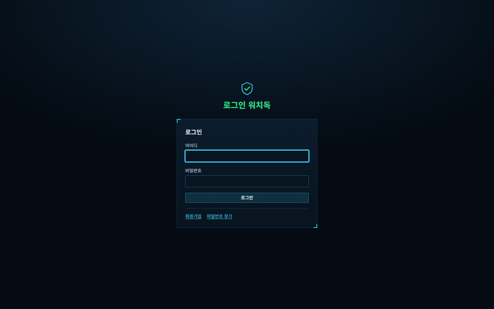
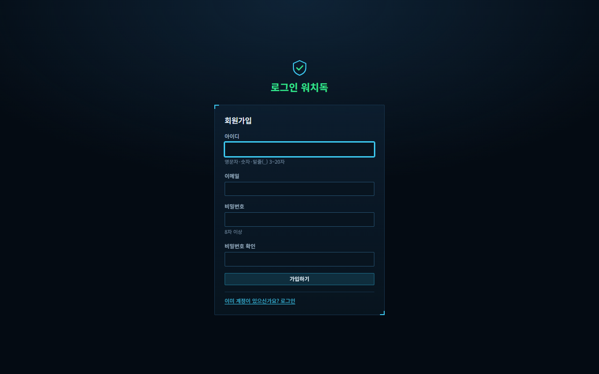
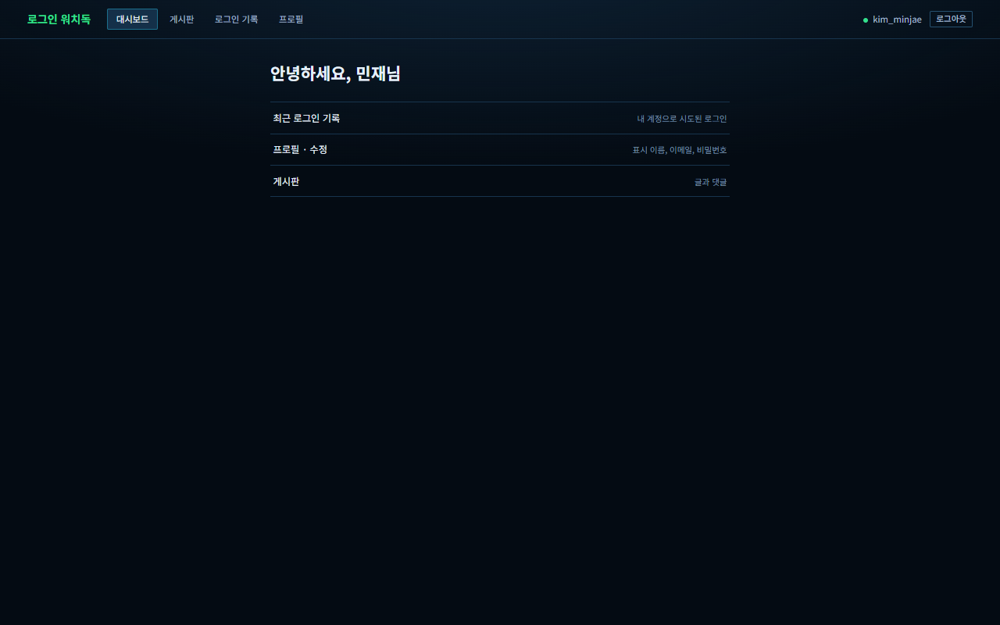
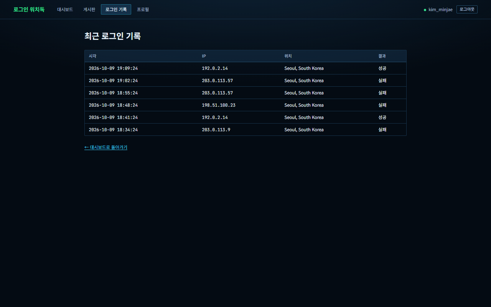
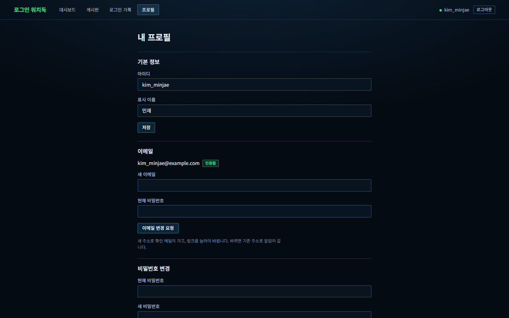
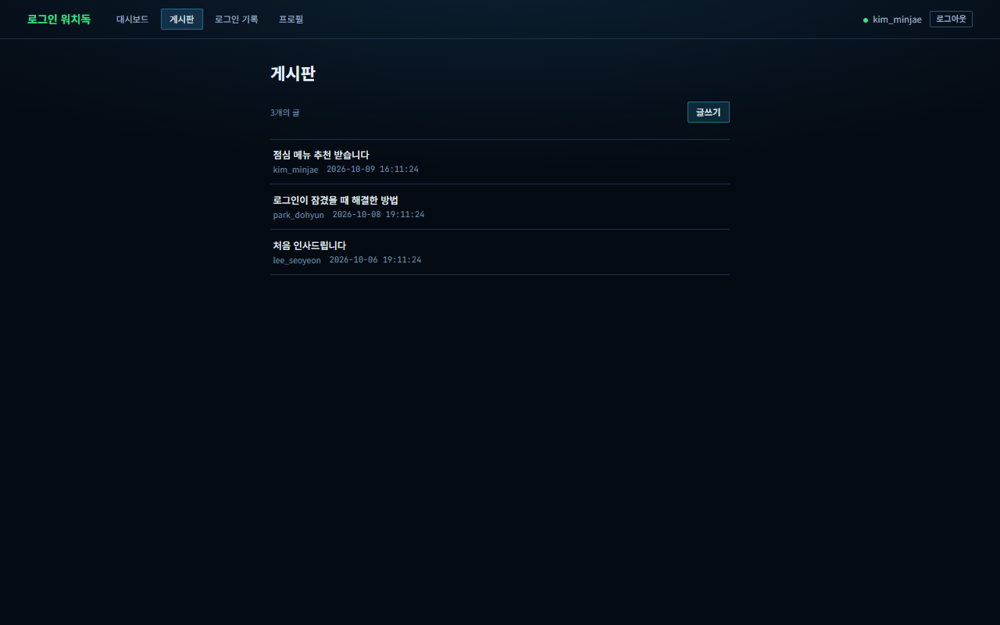
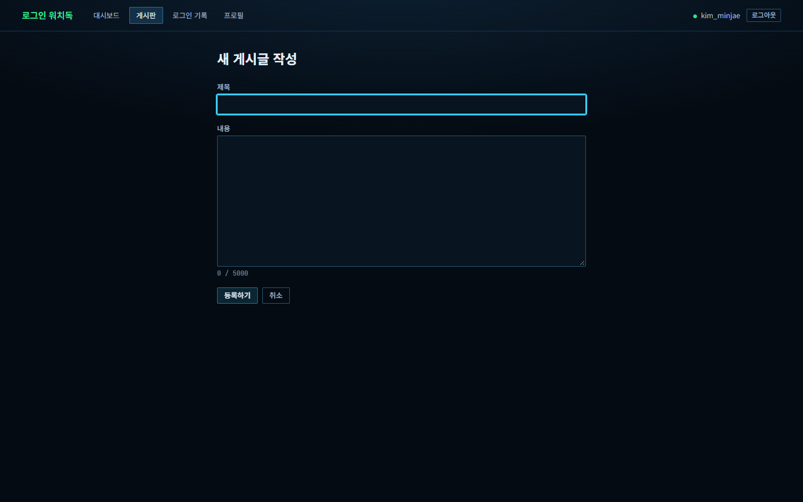
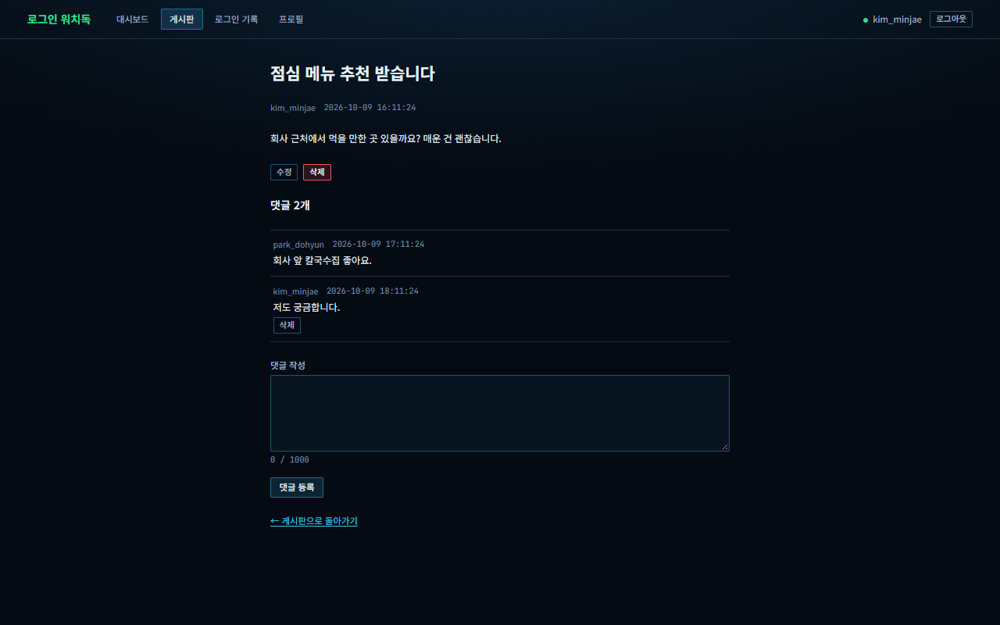

# 로그인 워치독 (login-watchdog)

같은 IP에서 짧은 시간 안에 로그인을 반복해서 틀리면 자동으로 감지해 IP를 잠그고, Slack으로 알림을 보내고, 관리자가 대시보드에서 실시간으로 확인·해제할 수 있는 브루트포스 방어 데모 프로젝트입니다.

원래는 애플리케이션 계층(L7) 공격 — 브루트포스, 가입/게시글/댓글 도배, 웹 스캐닝, 미인증 API 호출, 클릭재킹, 봇 트래픽, SSRF, 오픈 리다이렉트 등 — 을 위험등급(CRITICAL/HIGH/MEDIUM/LOW)별로 탐지·대응하는 데 집중했습니다. 이제는 그 기반 위에서 **네트워크(L3)/전송(L4) 계층 공격**까지 관찰·대응 범위를 넓히는 것을 다음 목표로 하고 있습니다(SYN Flood, 포트 스캐닝 등 — 현재는 미구현, [알려진 제한사항](#알려진-제한사항) 참고).

**배포 주소**: https://login-watchdog.vercel.app (Vercel — 회원가입/로그인/관리자 대시보드까지 실제 스모크 테스트로 검증됨)

## 주요 기능

- **Next.js 관제 화면** — 모든 화면(관리자 3개 + 로그인·가입·회원·게시판·복구)이 Next.js(React) 정적 빌드로 그려지고, 기존처럼 `python app.py`가 서빙합니다. 관리자는 벽 모니터형 관제 보드 3개 — **위협 현황**(`/admin/dashboard`, 시간대별 추이·7일 로그량·공격자 히트맵·공격 흐름도·신규 공격자·잠금 현황·미처리 이벤트·연관 사건 표), **공격 상세**(`/admin/attack`, Top 5·국가별 흐름·실시간 이벤트), **처리 작업대**(`/admin/ops`, 기존 처리 기능 전부)를 씁니다. L3/L4 공격은 아직 수집하지 않아 "수집 전" 빈 상태로 표시합니다. 구조·개발 방법은 [guide48_nextjs_dashboard.md](docs/beginner-guide/guide48_nextjs_dashboard.md) 참고
- **회원가입 / 로그인** — Supabase에 저장된 실제 계정으로 로그인하는 감시 대상 화면 (`/signup`, `/login`)
- **브루트포스 탐지 + 자동 잠금** — 같은 IP가 60초 안에 5회 초과 로그인 실패 시 해당 IP를 5분간 자동 잠금
- **Slack 알림** — 잠금이 발생하는 순간 Slack 채널에 시각·IP·실패 횟수·조치 내용을 전송 (웹훅 미설정 시 콘솔 로그로 자동 대체)
- **회원 대시보드** (`/dashboard`) — 로그인한 회원 본인의 인사말 화면. 최근 로그인 기록(접속 국가/도시 포함) 조회, 표시 이름·이메일 프로필 수정, 비밀번호 변경(바꾸면 다른 기기의 로그인은 모두 해제) 가능
- **관리자 대시보드** (`/admin/dashboard`) — 세션 로그인으로 보호되는 별도 화면. 회원가입 On/Off, AI 조기 경보(승인/반려), 보안 이벤트, 연관 사건, 현재 잠긴 IP·계정(회원·관리자 계정 포함, "즉시 해제"), 영구 잠금 / 복구 요청 / IP 예외 카드(완전 해제는 `super_admin`만, 사유 필수), 최근 로그인 시도(접속 위치 포함), 등록된 회원(이메일 인증 배지, 삭제), 게시글·댓글 관리, 관리자 계정 관리(`super_admin`만), 관리자 로그인 기록을 5초 폴링으로 확인합니다. 버튼마다 역할별 권한을 서버가 확인합니다(RBAC).
- **통합 보안 위험등급** — Brute Force/Password Spraying/관리자 로그인 무차별 대입(CRITICAL), 가입·게시글·댓글 도배 거부(HIGH), Web Scanning·Unauthorized Access·반복 페이지 접근 관찰(MEDIUM)을 공통 `security_events` 표에 등급과 함께 기록. 관리자 대시보드 맨 위 "보안 이벤트" 표에서 등급 배지와 함께 조회하고, HIGH/MEDIUM은 "처리 완료" 버튼으로 처리(CRITICAL은 잠금 해제 시 자동 처리). Slack 메시지 첫 줄에도 등급 표시
- **IP 위치 조회** — [ip-api.com](https://ip-api.com)으로 접속 IP의 국가·도시를 조회해 회원/관리자 대시보드에 표시. 조회 결과는 Supabase(`ip_locations`)에 캐시되어 같은 IP를 반복 조회하지 않음(무료 API의 분당 45건 한도 대응)
- **게시판·댓글** (`/board`) — 로그인한 회원 전용 게시판. 글 작성/수정/삭제(본인 글만), 댓글 작성/삭제(본인 댓글만), 페이지 번호 방식 목록, 새 댓글이 달리면 알림 배너 표시. 관리자 대시보드에서는 별도로 전체 게시글·댓글을 조회·삭제 가능. 자세한 설계 배경은 [docs/board-comment/](docs/board-comment) 참고
- **L7 공격 방어 보강** — IP를 나눠 시도하는 분산/저속 브루트포스에 대한 계정 단위 잠금(CRITICAL), 클릭재킹/CSP 방어용 보안 응답 헤더와 전역 HTTP 플러딩 방어(HIGH), 로그인/가입/글쓰기/댓글 폼의 허니팟 봇 차단과 로그인 타이밍 사이드채널 제거·SSRF 입력 검증(MEDIUM), CSRF 에러 핸들러 오픈 리다이렉트 수정(LOW)까지 위험등급별로 대응. 자세한 내용은 [docs/beginner-guide/guide24_l7_attack_hardening.md](docs/beginner-guide/guide24_l7_attack_hardening.md) 참고
- **관리자 역할 기반 접근 제어(RBAC)** — 관리자 계정이 `security_viewer`(조회만) / `security_admin`(IP 잠금 해제·보안 이벤트 처리·연관 사건 해결) / `super_admin`(회원·게시글·댓글 삭제, 회원가입 On/Off, 관리자 계정 관리까지 전부)으로 나뉘어, 로그인만 되면 뭐든 할 수 있던 이진 구조를 액션 단위 권한으로 세분화. 요청마다 실시간으로 역할을 조회해 권한 회수가 재로그인 없이 즉시 반영됨. `super_admin`은 대시보드 안 "관리자 계정 관리" 카드에서 `security_viewer`/`security_admin` 계정을 직접 생성·삭제할 수 있음(터미널 스크립트 없이) — 단 `super_admin` 계정 자체는 이 화면의 생성·삭제 대상에서 화면과 서버 양쪽에서 제외되어 "1명만 둔다"는 정책이 코드로도 지켜짐. 자세한 내용은 [docs/beginner-guide/guide26_rbac_foundation.md](docs/beginner-guide/guide26_rbac_foundation.md) 참고
- **SIEM 상관분석** — 같은 IP가 `security_events`에 짧은 시간(기본 5분) 안에 서로 다른 유형의 이벤트를 2개 이상 남기면(예: 웹 스캐닝 → 브루트포스), 단발성 이벤트로 각각 남기는 대신 `security_incidents`로 묶어 "하나의 공격 흐름"임을 표시. 사건은 IP 잠금 해제와 별개로, 관리자가 대시보드의 "해결" 버튼을 눌러야만 해결됨(CLOSED)이 되며 누가 언제 해결했는지도 기록됨(마지막 이벤트로부터 30분 넘게 조용하면 옛 사건은 "활동 없음"(IDLE)으로 옮겨지고 새 사건이 열림). 관리자 대시보드 "보안 이벤트" 표 바로 아래 "연관 사건" 표에서 확인 가능. 자세한 내용은 [docs/beginner-guide/guide27_siem_correlation.md](docs/beginner-guide/guide27_siem_correlation.md), 사건 해결 분리는 [guide32_incident_resolution.md](docs/beginner-guide/guide32_incident_resolution.md) 참고
- **SOAR 플레이북 고도화** — 상관분석으로 묶인 사건이 CRITICAL 등급이면서 서로 다른 공격 유형이 3개 이상 겹치면, 개별 이벤트 알림과 별도로 "복합 공격 발생" 에스컬레이션 알림을 Slack에 추가로 전송. 같은 사건이 갱신될 때마다 반복 알림이 나가지 않도록 사건당 한 번만 발송. 자세한 내용은 [docs/beginner-guide/guide28_soar_playbook.md](docs/beginner-guide/guide28_soar_playbook.md) 참고
- **API 엔드포인트별 매크로/봇 탐지** — 같은 IP가 60초 안에 서로 다른 `/api/*` 경로를 5개 초과해서 호출하면(대시보드 자동 폴링 API는 제외) MEDIUM 관찰 알림. 기존 `track_page_access()`가 "GET, 같은 경로 하나의 반복"만 보던 사각지대(POST API, 여러 경로에 걸친 패턴)를 메운다. 자세한 내용은 [docs/beginner-guide/guide29_macro_bot_detection.md](docs/beginner-guide/guide29_macro_bot_detection.md) 참고
- **LLM 조기 경보 (AI 판단 에이전트)** — 임계값을 아직 넘지 않았지만 코앞인 구간(기준 − `EARLY_WARNING_BAND`, 기본 2)에서 Groq(LLM)에게 "지켜볼 필요가 있는지" 물어, 위험하다고 판단하면 관리자 승인 대기(`access_requests`)로 올리고 Slack으로 알립니다. 관리자가 "승인"하면 원래 기준을 넘었을 때 하던 조치(IP·계정 잠금 등)가 실행되고, "반려"하면 아무 일도 일어나지 않습니다. 공격자가 아이디 칸에 넣은 문장이 지시로 읽히지 않게 프롬프트 인젝션을 방어하고, `GROQ_API_KEY`가 없거나 호출이 실패하면 조용히 건너뜁니다. `scripts/management/daily_report.py --ai`도 같은 부품으로 하루치 리포트의 AI 총평을 씁니다. 자세한 내용은 [guide31_llm_judgment_agent.md](docs/beginner-guide/guide31_llm_judgment_agent.md) 참고
- **영구 잠금 + 이메일 인증 해제** — 같은 IP/계정이 최근 30일 안에 두 번째로 잠기거나(반복 위반), 상관분석 사건이 CRITICAL이면 5분 임시 잠금이 자동 만료 없는 **영구 잠금**으로 올라갑니다(HIGH 사건은 기본적으로 관리자 승인 대기). 계정 잠금은 본인 이메일 인증(`/recovery`)으로 해제하고(이후 24시간 보호관찰), IP 잠금은 인증한 "본인 + 본인 기기"에게만 예외를 발급합니다(같은 공유 IP의 공격자는 계속 차단). 관리자 로그인 IP 잠금과 이메일을 신뢰할 수 없는 계정은 관리자만 풀 수 있습니다. 대시보드 "영구 잠금" 카드에서 **super_admin만** 사유를 입력해 "영구 해제"할 수 있고(`release_permanent_lock` 권한), security_admin은 수동 승격·예외 회수·복구 요청 취소까지 가능합니다. 자세한 내용은 [guide33_permanent_lock.md](docs/beginner-guide/guide33_permanent_lock.md), [guide34a_email_recovery.md](docs/beginner-guide/guide34a_email_recovery.md) 참고
- **비밀번호 변경 + 다른 기기 로그인 해제** — 회원은 '내 프로필'(`/dashboard/profile`)에서 현재 비밀번호를 확인한 뒤 비밀번호를 바꿀 수 있습니다. 현재 비밀번호를 틀리면 로그인 실패와 같은 기준으로 기록·잠금되어 이 화면이 비밀번호 대입 우회로가 되지 않고, 바꾸면 세션 세대 번호(`users.session_version`)가 올라가 이 기기를 제외한 모든 로그인 세션(탈취된 세션 포함)이 끊기며 가입 이메일로 변경 알림이 갑니다. 자세한 내용은 [guide35_password_change.md](docs/beginner-guide/guide35_password_change.md) 참고
- **배포 환경 DB 연결 안정화** — Vercel(서버리스)에서 쉬던 Supabase 연결을 재사용하다 "Server disconnected"로 가끔 500이 나던 문제를, HTTP/1.1 연결과 조회 요청 1회 자동 재시도로 해결. 자세한 내용은 [guide36_db_connection.md](docs/beginner-guide/guide36_db_connection.md) 참고
- **복구 코드 시도 제한 보강 + 관리자 세션 검증** — 6자리 복구 코드는 비교하기 전에 시도권을 조건부 UPDATE로 먼저 예약해서, 동시에 여러 번 보내도 5회를 넘겨 맞춰볼 수 없습니다(`/recovery/verify`에 IP당 분당 10회 한도도 추가). 관리자 세션은 요청마다 DB의 계정(id·아이디)과 대조하고 로그인 후 8시간(`ADMIN_SESSION_MAX_HOURS`)이 지나면 만료되어, 삭제된 관리자의 쿠키로는 대시보드를 볼 수 없습니다. 배포 직후 관리자는 한 번 다시 로그인해야 합니다. 자세한 내용은 [guide37_session_and_code_hardening.md](docs/beginner-guide/guide37_session_and_code_hardening.md) 참고
- **관리자 계정 단위 잠금** — `/admin/login`도 회원처럼 계정 단위로 잠급니다. IP와 무관하게 한 관리자 아이디가 15분 안에 8회를 넘게 실패하면 5분간 잠기고(분산 브루트포스 대응), Slack CRITICAL 알림과 `ADMIN_DISTRIBUTED_BRUTE_FORCE` 이벤트가 남습니다. 회원 잠금과는 별도 표(`admin_account_lockouts`)라 같은 이름의 회원과 서로 영향을 주지 않고, 아이디가 없어도 똑같이 잠겨 관리자 아이디 존재 여부가 드러나지 않습니다. 잠금이 관리자를 쫓아내는 수단이 되지 않도록 허용 목록(`PERMANENT_LOCK_IP_ALLOWLIST`) IP는 계정 잠금을 건너뛰고, 영구 잠금으로는 올리지 않습니다. 해제는 대시보드(super_admin 전용) 또는 `scripts/management/unlock_account.py --admin`. 자세한 내용은 [guide38_admin_account_lockout.md](docs/beginner-guide/guide38_admin_account_lockout.md) 참고
- **계정 존재 여부 노출 방지** — `/login`은 임시·영구 계정 잠금을 같은 문구와 같은 복구 링크로 안내합니다(영구 승격은 가입된 아이디에만 일어나서 "영구"라는 말이 가입 여부를 알려줬음). 복구용 6자리 코드는 계정·IP 복구 모두 **복구를 요청한 기기에서만** 받고, 아이디 없음·요청 없음·다른 기기를 같은 문구로 답하며 시도 횟수도 쓰지 않아, 다른 기기에서 진행 중인 복구를 알아내거나 남의 복구를 취소시킬 수 없습니다(메일 링크는 어느 기기에서나 동작). 자세한 내용은 [guide39_account_enumeration.md](docs/beginner-guide/guide39_account_enumeration.md) 참고
- **이메일 인증 + 이메일 변경 보호** — 가입하면 가입 이메일로 인증 링크가 가고(가입·로그인은 바로 가능), 대시보드에서 다시 보낼 수 있습니다. 이메일 상태는 미인증/인증됨/반송 3가지이고, 인증된 이메일로만 비밀번호 재설정 메일을 보냅니다(다음 단계). 이메일 변경은 **현재 비밀번호 + 새 주소로 보낸 확인 링크**를 거쳐야 반영되고, 바뀌면 기존 주소로 알림이 갑니다 — 세션만 탈취한 사람이 이메일을 바꿔 계정을 가져가는 경로를 막습니다. 이미 다른 계정이 쓰는 주소여도 화면 응답은 같습니다. 자세한 내용은 [guide40_email_verification.md](docs/beginner-guide/guide40_email_verification.md) 참고
- **비밀번호 찾기** — 로그인 화면의 "비밀번호 찾기"(또는 프로필의 "이메일로 재설정")에서 아이디를 입력하면, **인증된 이메일**로만 재설정 링크(15분, 1회용)가 갑니다. 아이디가 없든 미인증이든 화면 응답과 응답 시간은 같습니다. 새 비밀번호를 검사한 뒤에야 링크를 소비하고, 재설정하면 모든 기기의 로그인이 끊기며 알림 메일이 갑니다. 자세한 내용은 [guide41_password_reset.md](docs/beginner-guide/guide41_password_reset.md) 참고
- **복구 요청 한도 + 처리 시간 기록** — `/recovery/request`에 IP당 분당 5회 한도(`RECOVERY_REQUEST_RATE_LIMIT_PER_MINUTE`)를 걸어, 응답마다 고정 시간만큼 함수를 붙잡는 이 요청으로 IP 하나가 함수를 묶어 둘 수 있는 횟수를 줄였습니다(한도를 넘기면 기다림 없이 바로 429). 복구·비밀번호 찾기 요청은 실제 처리 시간을 `[timing]` 로그로 남기고(고정 시간을 넘기면 `overrun`), 운영 실측(메일 발송 3.04초)을 근거로 고정 시간을 8초에서 **5초**로 줄였습니다. 자세한 내용은 [guide43_recovery_request_limit.md](docs/beginner-guide/guide43_recovery_request_limit.md) 참고
- **로그 자동 정리 + 일별 요약** — Supabase 예약 작업(pg_cron)이 매일 새벽 3시(한국 시간)에 **어제 하루치를 먼저 요약**한 뒤 보관 기간이 지난 기록을 지웁니다(접속·시도 기록과 끝난 메일 링크 30일, 로그인 기록과 처리 완료된 보안 기록 90일). 요약표에는 처음 기록된 날부터 어제까지 모든 날짜의 시간대별 건수(`log_daily_summary`)와 하루 상세(`log_daily_breakdown` — IP 수, 로그인 실패에서 노린 아이디 수, 많이 노린 주소 상위 5개, 로그인 기록의 나라별 건수)가 영구히 남아 대시보드 시각화에 쓸 수 있습니다. IP·아이디 자체는 남기지 않습니다. 처리 전인 이벤트·대기 중인 링크·잠금 이력·회원 정보는 지우지 않습니다. 자세한 내용은 [guide44_log_retention.md](docs/beginner-guide/guide44_log_retention.md), [guide47_daily_log_summary.md](docs/beginner-guide/guide47_daily_log_summary.md) 참고
- **보이지 않는 탭은 폴링하지 않음** — 관리자 대시보드(5초마다 `/api/status`, 요청 한 번에 DB 조회 약 21번)와 게시글 새 댓글 확인은 공용 부품 `public/js/polling.js`로 돕니다. 탭이 숨겨지면(다른 탭·창 최소화) 멈추고, 다시 보이면 즉시 한 번 갱신한 뒤 재개합니다. 응답을 받은 뒤에 다음 요청을 예약해서 서버가 느려도 요청이 겹치지 않습니다. 자세한 내용은 [guide45_visible_tab_polling.md](docs/beginner-guide/guide45_visible_tab_polling.md) 참고
- **대시보드 즉시 반응** — 페이지 버튼을 누르면 응답을 기다리지 않고 번호가 바로 바뀌고 표가 "불러오는 중"으로 흐려지며, 그 표 하나만 서버에 요청합니다(`/api/status?only=<표>`, DB 조회 약 21번 → 1~2번). 해제·삭제 같은 처리 버튼은 누르는 즉시 "처리 중…"으로 바뀌어 두 번 눌리지 않습니다. 전체 갱신은 조회를 한 번에 보내고 만료된 잠금 정리는 15초에 한 번만 해서(`ADMIN_STATUS_RELEASE_INTERVAL_SECONDS`) 더 빨라졌습니다. 자세한 내용은 [guide46_dashboard_responsiveness.md](docs/beginner-guide/guide46_dashboard_responsiveness.md) 참고
- **IPv6는 /64 대역 단위** — IPv6 사용자는 /64 대역 안에서 주소를 거의 공짜로 바꿀 수 있어서, 요청 IP를 한 곳(`helpers.get_request_ip`)에서 대역 키(예: `2001:db8:1:2::/64`)로 정규화합니다. 로그인 실패 집계·IP 잠금·요청 제한·보안 이벤트가 모두 대역 단위로 동작합니다(IPv4는 그대로). 현재 배포 주소에는 IPv6 입구가 없어 운영에는 IPv6가 들어오지 않으며, 호스팅 변경·자체 서버 운영에 대비한 것입니다. 자세한 내용은 [guide42_ipv6_prefix.md](docs/beginner-guide/guide42_ipv6_prefix.md) 참고
- **임계값 튜닝 리포트** — `scripts/management/tune_thresholds.py`로 최근 N일간 CRITICAL(IP/계정 잠금) 이벤트 중 관리자가 자동 만료를 기다리지 않고 훨씬 빨리 수동 해제한 비율을 event_type별로 집계. 오탐(너무 예민한 임계값) 여부를 점검하는 완전한 읽기 전용 도구. 자세한 내용은 [docs/beginner-guide/guide30_threshold_tuning.md](docs/beginner-guide/guide30_threshold_tuning.md) 참고

## 기술 스택

| 영역 | 사용 기술 |
|---|---|
| 백엔드 | Flask (Blueprint 7개로 라우트 분리, `routes/` 참고) + Flask-Limiter (전역·라우트별 요청 빈도 제한) + Flask-WTF (CSRF) |
| 데이터베이스 | Supabase (PostgreSQL) — 서버리스에서 쉬던 연결이 끊기는 문제를 막으려고 HTTP/1.1 연결 + 조회 1회 재시도로 접속 (`db/_client.py`). 로그 일별 요약·정리는 DB 안의 예약 작업(pg_cron) |
| 알림 | Slack Incoming Webhook |
| 메일 | SMTP(파이썬 표준 `smtplib`) — 배포는 Gmail SMTP(앱 비밀번호), 개발은 console 출력 또는 Mailpit(Docker) |
| AI | Groq API (LLM 조기 경보, 일일 리포트 AI 총평) — `services/llm_client.py` |
| IP 위치 | ip-api.com (결과는 Supabase `ip_locations`에 캐시) |
| 인증 | Flask 세션 + `werkzeug.security` (비밀번호 해시) |
| 프런트엔드 | Next.js(React, TypeScript) 정적 내보내기 + Apache ECharts — 소스는 `web/`, 빌드 결과는 `spa/`·`public/_next/`. 빌드가 없으면 예전 Jinja 화면(`templates/`)으로 자동 폴백 |
| 테스트 | pytest |

## 시작하기 (Getting Started)

### 1. 저장소 클론
```bash
git clone https://github.com/dyj02056/login-watchdog.git
cd login-watchdog
```

### 2. 가상환경 생성 및 패키지 설치
```bash
python -m venv venv
source venv/Scripts/activate   # Windows PowerShell: .\venv\Scripts\Activate.ps1
pip install -r requirements.txt
```

### 3. Supabase 프로젝트 준비
1. [supabase.com](https://supabase.com)에서 프로젝트 생성
2. **SQL Editor**에서 [docs/schema.sql](docs/schema.sql) 내용 전체 실행 (테이블 30개 생성 — 표별 설명은 [docs/feature-reference/db-schema-guide.md](docs/feature-reference/db-schema-guide.md), 관계도는 [ERD.svg](docs/feature-reference/ERD.svg)). 영구 잠금 기능(guide33)을 쓰려면 기존 DB에는 [docs/migrations/guide33_permanent_lock.sql](docs/migrations/guide33_permanent_lock.sql)을, 비밀번호 변경 기능(guide35)을 쓰려면 [docs/migrations/guide35_password_change.sql](docs/migrations/guide35_password_change.sql)을 **추가로** 실행해야 합니다(`schema.sql` 맨 아래에도 같은 내용이 들어 있고, 여러 번 실행해도 안전합니다). 특히 guide35 SQL은 **새 코드를 배포하기 전에** 실행해야 합니다 — 없으면 회원 화면 전체가 오류가 납니다. 관리자 계정 단위 잠금(guide38)을 쓰려면 [docs/migrations/guide38_admin_account_lockout.sql](docs/migrations/guide38_admin_account_lockout.sql)도 **배포 전에** 실행해야 합니다 — 없으면 `/admin/login`과 대시보드가 오류가 납니다. 이메일 인증(guide40)은 [docs/migrations/guide40_email_verification.sql](docs/migrations/guide40_email_verification.sql)을 **배포 전에** 실행해야 합니다 — 없으면 회원가입과 회원 화면이 오류가 납니다. 로그 자동 정리(guide44)는 [docs/migrations/guide44_log_retention.sql](docs/migrations/guide44_log_retention.sql)을 실행한 뒤 [docs/migrations/guide47_daily_log_summary.sql](docs/migrations/guide47_daily_log_summary.sql)까지 실행하면 켜집니다(앱 코드와 무관해서 언제 실행해도 됩니다)
3. **Project Settings → API**에서 `Project URL`과 `service_role` key 확인

### 4. 환경변수 설정
`.env.example`을 복사해 `.env`를 만들고 아래 값을 채웁니다. (`.env`는 `.gitignore`로 보호되어 커밋되지 않습니다.)

```bash
cp .env.example .env
```

| 키 | 설명 |
|---|---|
| `SUPABASE_URL` | Supabase 프로젝트 루트 주소 (`https://xxxx.supabase.co`, 끝에 `/rest/v1/` 등 경로를 붙이지 않음) |
| `SUPABASE_KEY` | `service_role` key (서버 전용, 절대 노출 금지) |
| `SLACK_WEBHOOK_URL` | Slack Incoming Webhook 주소. 비워두면 알림이 콘솔 로그로 대체됨 |
| `SECRET_KEY` | Flask 세션 쿠키 서명용 임의 문자열 (예: `python -c "import secrets; print(secrets.token_hex(32))"`) |
| `ADMIN_USERNAME` / `ADMIN_PASSWORD` | 서버 최초 기동 시 자동 생성될 관리자 계정 (이미 계정이 있으면 무시됨). RBAC 도입 후 이 계정을 `super_admin`으로 지정하려면 `docs/schema.sql`의 `update admin_users set role = 'super_admin' where username = '...'`을 이 값과 맞게 수정해서 실행해야 함 |
| `TRUST_FORWARDED_FOR` | `X-Forwarded-For` 헤더 신뢰 여부. **데모/시연 전용, 운영에서는 반드시 `false`** |
| `PERMANENT_LOCK_*` | 영구 잠금 정책 — `STRIKE_COUNT`/`ACCOUNT_STRIKE_COUNT`(기본 2회째 승격), `STRIKE_WINDOW_DAYS`(30), `AUTO_ON_HIGH`(false=HIGH 사건은 관리자 승인 대기), `AUTO_CLOSE_INCIDENT`(false), `IP_ALLOWLIST`(기본 `127.0.0.1,::1` — **관리자 PC IP를 꼭 추가**) |
| `MAIL_BACKEND` / `SMTP_*` / `MAIL_FROM` / `PUBLIC_BASE_URL` | 복구 메일 발송. 개발은 `console`(터미널 출력, 운영에서는 거부됨) 또는 Mailpit(`docker compose -f docker-compose.mailpit.yml up -d`, `SMTP_HOST=127.0.0.1` `SMTP_PORT=1025` `SMTP_STARTTLS=false`, 받은 메일은 http://127.0.0.1:8025). **배포(Vercel)** 는 `MAIL_BACKEND=smtp` + Gmail SMTP(앱 비밀번호) 설정이 필요합니다 — 환경변수 목록과 점검 방법은 [guide34a_email_recovery.md](docs/beginner-guide/guide34a_email_recovery.md)의 "배포(Vercel)에서 복구 메일 보내기" 참고. `PUBLIC_BASE_URL`은 복구 링크의 기준 주소로, Host 헤더 대신 이 값만 씁니다. 설정은 `python scripts/management/send_test_mail.py --to 내주소@gmail.com`으로 미리 확인할 수 있습니다 |
| `FLASK_ENV` | 배포(Vercel)에서는 반드시 `production` — 세션·기기 쿠키에 Secure가 붙고, 토큰을 로그에 찍는 console 메일 백엔드가 차단됩니다. 로컬 HTTP 서버에서 이 값을 켜면 로그인 쿠키가 전송되지 않으니 로컬에서는 비워 두세요 |
| (선택) `IPV6_PREFIX_LENGTH` | IPv6를 몇 비트 대역 단위로 세고 잠글지(기본 64, guide42). 회선 하나에 /56·/48을 주는 환경이면 줄입니다 |
| (선택) `PASSWORD_RESET_MAX_PER_DAY` / `PASSWORD_RESET_MAX_PER_IP_PER_HOUR` / `PASSWORD_RESET_RATE_LIMIT_PER_MINUTE` | 비밀번호 찾기(guide41): 회원당 하루 3회, IP당 시간당 5회, 요청·재설정 제출 IP당 분당 10회. 응답 시간은 `RECOVERY_MIN_RESPONSE_SECONDS`를 같이 씁니다 |
| (선택) `EMAIL_TOKEN_TTL_MINUTES` / `EMAIL_TOKEN_COOLDOWN_SECONDS` / `EMAIL_TOKEN_MAX_PER_DAY` / `EMAIL_CONFIRM_RATE_LIMIT_PER_MINUTE` | 이메일 인증·변경 확인 링크(guide40): 유효 15분, 같은 회원·용도 재발송 60초 간격·하루 5회, 확인 제출 IP당 분당 10회 |
| (선택) `ADMIN_ACCOUNT_FAILURE_THRESHOLD` / `ADMIN_ACCOUNT_DETECTION_WINDOW_SECONDS` | 관리자 계정 단위 잠금 기준(기본 8회 초과 / 900초=15분, guide38). IP와 무관하게 한 관리자 아이디의 실패를 셉니다 |
| (선택) `ADMIN_SESSION_MAX_HOURS` | 관리자 세션 최대 수명(시간, 기본 8). 로그인 시각부터 세며, 지나면 다시 로그인해야 합니다(guide37) |
| (선택) `RECOVERY_*`, `IP_EXEMPTION_*`, `SMTP_USE_SSL`, `SMTP_TIMEOUT_SECONDS`, `MAIL_FAILURE_ALERT_COOLDOWN_SECONDS` | 복구 정책(토큰 유효 15분, 요청 한도, 응답 고정 5초, 보호관찰 24시간 등)과 메일 세부 설정. 기본값으로 충분하며 전체 목록은 [.env.example](.env.example)과 [guide34a](docs/beginner-guide/guide34a_email_recovery.md) 참고 |
| (선택) `GROQ_API_KEY` | LLM 조기 경보와 `daily_report.py --ai`의 AI 총평에 쓰는 Groq API 키. 비워두면 조기 경보만 조용히 건너뛰고 나머지 기능은 그대로 동작 |
| (선택) 탐지 임계값·폴링 주기 | `FAILURE_THRESHOLD`(5), `ACCOUNT_FAILURE_THRESHOLD`(8), `DETECTION_WINDOW_SECONDS`(60), `LOCKOUT_DURATION_SECONDS`(300), `EARLY_WARNING_BAND`(2), `ADMIN_DASHBOARD_POLL_MS`(5000) 등 — 전체 목록과 기본값은 [config.py](config.py) 참고 |
| `VERCEL_AUTOMATION_BYPASS_SECRET` | Vercel Authentication(프리뷰 배포 보호)을 우회하는 Protection Bypass Secret. `scripts/simulation/critical/bruteforce_sim.py`로 Vercel 프리뷰 배포를 대상으로 테스트할 때만 필요, 로컬 서버·운영 배포에는 불필요 |

### 5. 서버 실행
```bash
python app.py
```
Next.js 화면의 빌드 결과(`spa/`, `public/_next/`)는 저장소에 들어 있어서 따로 빌드하지 않아도 그대로 뜹니다. 화면 소스(`web/`)를 고쳤다면 먼저 빌드하세요.
```bash
cd web
npm ci          # 처음 한 번
npm run build   # 빌드 후 spa/ 와 public/_next/ 를 갱신
```
가짜 데이터로 관제 화면만 확인하려면(Supabase 접속 없음) `python scripts/demo/demo_server.py` 후 http://127.0.0.1:5077/__demo_login 을 엽니다.

기본적으로 `http://localhost:5000`에서 실행됩니다. 해당 포트가 이미 사용 중이면 `PORT` 환경변수로 다른 포트를 지정할 수 있습니다(`PORT=5050 python app.py`).

### 6. 접속 주소

| 주소 | 설명 |
|---|---|
| `/signup` | 회원가입 (감시 대상 계정 생성) |
| `/login` | 감시 대상 로그인 — 이 화면에서의 실패 시도가 탐지 대상. 로그인 성공 시 `/dashboard`로 이동 |
| `/dashboard` | 회원 대시보드 — 인사말, 이메일 인증 안내 (회원 로그인 필요) |
| `/dashboard/history` · `/dashboard/profile` | 본인 로그인 기록 · 프로필(표시 이름, 이메일 변경, 비밀번호 변경) |
| `/recovery` | 잠긴 계정·IP를 이메일 인증으로 푸는 복구 요청 화면 |
| `/password/forgot` | 비밀번호 찾기(인증된 이메일로 재설정 링크) |
| `/email/confirm` | 메일 링크가 여는 이메일 인증·변경 확인 화면 |
| `/admin/login` | 관리자 로그인 |
| `/admin/dashboard` | 관제 보드 ① 위협 현황 — KPI·차트·히트맵·공격 흐름·공격자 표 (관리자 로그인 필요) |
| `/admin/attack` | 관제 보드 ② 공격 상세 모니터링 — Top 5·국가별 흐름·최근 보안 이벤트 |
| `/admin/ops` | 관제 보드 ③ 처리 작업대 — 보안 이벤트·연관 사건·AI 조기 경보·잠금(임시/영구) 관리·회원·게시판·관리자 계정 관리 |
| `/board` | 게시판 목록 (회원 로그인 필요) |
| `/board/new` | 새 게시글 작성 (회원 로그인 필요) |
| `/board/<id>` | 게시글 상세 · 댓글 (회원 로그인 필요) |

## 화면 미리보기

### 인증

<table>
<tr>
<td align="center"><b>로그인</b><br>(관리자 로그인 <code>/admin/login</code>도 동일 화면 공유)</td>
<td align="center"><b>회원가입</b></td>
</tr>
<tr>
<td></td>
<td></td>
</tr>
</table>

### 회원 대시보드

<table>
<tr>
<td align="center"><b>대시보드</b></td>
<td align="center"><b>로그인 기록</b></td>
<td align="center"><b>프로필</b></td>
</tr>
<tr>
<td></td>
<td></td>
<td></td>
</tr>
</table>

### 게시판

<table>
<tr>
<td align="center"><b>목록</b></td>
<td align="center"><b>글쓰기</b></td>
<td align="center"><b>상세 · 댓글</b></td>
</tr>
<tr>
<td></td>
<td></td>
<td></td>
</tr>
</table>

> 관리자 대시보드(`/admin/dashboard`) 스크린샷은 실제 접속 로그(IP·위치 등 민감 정보)가 노출되어 이 문서에는 포함하지 않았습니다.

## 테스트 실행

```bash
pytest tests/
```
실제 Supabase에 접속하지 않고 가짜 데이터(monkeypatch)로 판정 로직만 검증하므로 몇 초 안에 끝납니다. 현재 총 693개 테스트가 모두 통과합니다.

## 유지보수 스크립트
(김재호)
Web Scanning 탐지는 `py scripts/simulation/medium/web_scanning_sim.py --host http://127.0.0.1:5000`으로
GET 11회를 보내 재현할 수 있습니다. [실행 조건과 알림 확인 방법](docs/web-scanning-demo.md)을 참고하세요.

`scripts/` 아래에 있으며, 웹 서버(`app.py`)와 별개로 터미널에서 직접 실행하는 도구들입니다. 실행 전 가상환경 활성화가 필요합니다(`.\venv\Scripts\Activate.ps1` 등).

| 스크립트 | 역할 |
|---|---|
| `scripts/simulation/critical/bruteforce_sim.py` | `/login`에 일부러 틀린 비밀번호를 반복 제출해, 설정된 횟수(기본 5회 초과)에서 실제로 IP가 잠기는지 검증하는 시뮬레이터. 팀이 소유한 로컬 서버만 대상으로 하며, 그 외 주소는 `--i-know-what-im-doing` 없이는 거부됨. `--ip`로 가짜 공격자 IP를 지정하거나, Vercel 프리뷰 배포처럼 Vercel Authentication이 걸린 주소를 대상으로 할 때는 `--bypass-secret`으로 우회할 수도 있음(아래 참고) |
| `scripts/management/daily_report.py` | 최근 N시간(기본 24시간, `--hours`) 또는 지정 기간(`--start`/`--end`)의 로그인 시도·잠금 현황을 텍스트로 요약(`--output`으로 파일 저장). `--ai`를 붙이면 Groq가 쓴 AI 보안 총평을 덧붙임 |
| `scripts/management/unlock_ip.py` | 지금 잠겨있는 IP를 조회하거나 즉시 해제. `/admin/login`도 `/login`과 같은 IP 기준 잠금을 공유하므로, 브루트포스 시뮬레이션 도중 관리자 계정 IP까지 함께 잠기면 대시보드의 "즉시 해제" 버튼조차 쓸 수 없는 상황이 생기는데(로그인 자체가 막혀서), 이때 서버·로그인 없이 터미널에서 바로 풀 때 사용. 영구 잠금은 `--permanent`를 붙여야만 풀리고(`--note`로 해제 사유 기록), 없으면 건너뜀 |
| `scripts/management/unlock_account.py` | 잠긴 계정(분산 브루트포스 대응 계정 잠금)을 조회하거나 즉시 해제. 영구 잠금은 `unlock_ip.py`와 같이 `--permanent`가 있어야 풀림 |
| `scripts/management/send_test_mail.py` | 지금 메일 설정(SMTP)으로 테스트 메일 한 통을 보내 접속·인증·발송이 되는지 확인. 실패하면 원인(`CONFIG`/`AUTH`/`CONNECT`/`OTHER`)과 고칠 곳을 알려주며, 비밀번호는 출력하지 않음 |
| `scripts/management/create_admin.py` | `security_viewer`/`security_admin`/`super_admin` 역할을 가진 새 관리자 계정을 생성. 대시보드 "관리자 계정 관리" 카드는 `super_admin`이 `security_viewer`/`security_admin`만 만들 수 있는 것과 달리, 이 스크립트는 터미널 접근 자체가 신뢰된 작업이라는 전제로 `super_admin`도 만들 수 있음(예: 최초 팀원 온보딩) |
| `scripts/simulation/medium/macro_bot_sim.py` | 이미 만들어진 관리자 계정으로 로그인한 뒤, 서로 다른 관리자 API 6개를 순서대로 호출해 매크로/봇 탐지가 실제로 알림을 울리는지 검증. `security_viewer`(무권한) 계정으로 실행하면 6번 모두 403으로 안전하게 거절되면서도 탐지 로그는 정상적으로 남음 |
| `scripts/management/delete_security_events.py` | 보안 이벤트를 터미널에서 영구 삭제(`--id` 한 건 / `--resolved` 처리 완료된 것 전부 / `--all` 전부). 옵션 없이 실행하면 건수만 조회 |
| `scripts/simulation/critical/password_spraying_sim.py` · `signup_abuse_sim.py` · `spam_sim.py` · `repeated_access_sim.py` · `unauthorized_access_sim.py` · `web_scanning_sim.py` | 패스워드 스프레이·가입 도배·글 도배·반복 페이지 접근·미인증 API 접근·웹 스캐닝을 로컬 서버에 재현해 탐지·알림을 확인하는 시뮬레이터(공용 부품은 `scripts/simulation/_sim_common.py`). 기본 대상은 로컬 서버이며, 본인 소유·허가된 서버에만 사용(일부는 로컬이 아닌 주소를 `--i-know-what-im-doing` 없이 거부) |
| `scripts/management/tune_thresholds.py` | 최근 N일(기본 7일)간 CRITICAL 잠금 중 자동 만료 전에 수동으로 조기 해제된 비율을 event_type별로 집계하는 완전한 읽기 전용 리포트. 비율이 높으면 임계값이 너무 예민할 수 있다는 신호 |
| `scripts/simulation/critical/` 신규 5종 | `distributed_bruteforce_sim`(IP를 바꿔 한 계정을 노리는 계정 단위 잠금) · `admin_bruteforce_sim`(`/admin/login` IP 잠금) · `admin_distributed_bruteforce_sim`(관리자 계정 단위 잠금) · `permanent_lock_sim`(임시 잠금 2회 → 영구 잠금, 기본 305초 대기) · `incident_correlation_sim`(정찰→침투→브루트포스 다단계 → 사건화·영구 차단). 가짜 IP는 서버 `TRUST_FORWARDED_FOR=true`일 때만 반영 |
| `scripts/simulation/high/` 신규 3종 | `http_flood_sim`(전역 요청 한도 429) · `comment_spam_sim`(댓글 도배, 테스트 계정 필요) · `recovery_flood_sim --target recovery\|recovery-verify\|password-forgot\|password-reset\|email-confirm`(엔드포인트별 좁은 한도 429) |
| `scripts/simulation/medium/honeypot_bot_sim.py` | 숨김 `website` 칸을 채워 `/login`·`/signup`에 제출하는 봇을 흉내 내 `BOT_DETECTED`로 걸러지는지 검증 |
| `scripts/demo/check_simulations.py` | 시뮬레이션 전체를 한 번에 점검. 메모리 DB(`memory_supabase.py`)를 붙인 서버를 127.0.0.1:5000에 띄워 시뮬레이션을 실행하고, 서버가 기대한 보안 이벤트를 실제로 기록했는지 대조한다(진짜 Supabase·Slack·메일 미접속). `python scripts/demo/check_simulations.py [이름 일부]` |

`bruteforce_sim.py`의 `--ip` 옵션: 로컬 환경에서는 팀원 전원이 다 같은 `127.0.0.1`로 접속하게 되어 "서로 다른 공격자 IP에서 왔다"는 상황을 재현할 수 없다. `--ip 1.2.3.4`를 주면 그 값을 `X-Forwarded-For` 헤더에 실어 보내는데, 이 헤더는 대상 서버의 `.env`에서 `TRUST_FORWARDED_FOR=true`로 켜뒀을 때만 실제 접속 IP처럼 반영된다(운영 환경 기본값인 `false`에서는 서버가 헤더를 무시하고 진짜 접속 IP를 그대로 씀 — 배포 사이트에서 이 옵션이 안전하게 아무 효과가 없는 이유).
```bash
python scripts/simulation/critical/bruteforce_sim.py --host http://127.0.0.1:5000 --username test1 --ip 1.2.3.4
```

`bruteforce_sim.py`의 `--bypass-secret` 옵션: Vercel 프리뷰 배포(`*.vercel.app`)는 기본적으로 Vercel Authentication으로 보호되어 있어, 팀원이 아니면 `/login` 화면 자체에 접근하지 못한다. `--bypass-secret`에 Vercel의 Protection Bypass Secret 값을 넘기면 `x-vercel-protection-bypass` 헤더로 실어 보내 이 보호를 우회한다. 생략하면 `.env`의 `VERCEL_AUTOMATION_BYPASS_SECRET` 값을 자동으로 사용하며, 로컬 서버를 대상으로 할 때는 지정해도 아무 효과가 없다.
```bash
python scripts/simulation/critical/bruteforce_sim.py --host https://<브랜치>-git-<프리뷰경로>.vercel.app --username test1 --i-know-what-im-doing
```

`unlock_ip.py` 사용 예:
```bash
python scripts/management/unlock_ip.py                # 현재 활성 잠금 목록만 조회 (아무것도 바꾸지 않음)
python scripts/management/unlock_ip.py --ip 127.0.0.1  # 이 IP 하나만 즉시 해제
python scripts/management/unlock_ip.py --all           # 활성 잠금 전부 즉시 해제 (영구 잠금은 건너뜀)
python scripts/management/unlock_ip.py --ip 1.2.3.4 --permanent --note "오탐 확인"   # 영구 잠금 해제 (사유 기록)
python scripts/management/unlock_account.py --username alice --permanent --note "본인 확인 완료"
```

`send_test_mail.py` 사용 예 (배포 전에 메일 설정 확인):
```bash
python scripts/management/send_test_mail.py --to 내이메일@gmail.com
```

`create_admin.py` 사용 예:
```bash
python scripts/management/create_admin.py --username sktviewer123 --password <비밀번호> --role security_viewer
python scripts/management/create_admin.py --username sktadmin123 --password <비밀번호> --role security_admin
```

## 프로젝트 구조

`app.py`(1,108줄)와 `db.py`(1,030줄)가 파일 하나에 너무 많은 책임을 담고 있어 원하는 코드를 찾기 어려워졌던 것을 계기로, 각각 `routes/` Blueprint와 `db/` 표 묶음별 패키지로 쪼갰습니다(배경은 [docs/refactor/2026-09-15-file-split.md](docs/refactor/2026-09-15-file-split.md) 참고). 이후 루트에 흩어져 있던 모듈 13개를 기능별 폴더(`security/`, `notify/`, `services/`, `helpers/`)로 묶고, 200줄이 훨씬 넘던 `routes/admin.py`·`soar.py`·`helpers.py`·대시보드 JS도 기능 묶음별로 나눴습니다(배경은 [docs/refactor/2026-10-09-module-plan.md](docs/refactor/2026-10-09-module-plan.md) 참고). 모듈 이름은 그대로라서 호출부는 `from security import soar` 후 `soar.enforce_lockout(...)`, `import db` 후 `db.log_attempt(...)`처럼 쓰며, 패키지 안의 어느 파일이 실제로 그 함수를 담고 있는지는 몰라도 됩니다.

```
login-watchdog/
├── app.py                         # Flask 진입점(Vercel이 루트의 app을 찾음) — 앱 생성, 세션/CSRF/요청 한도 설정, Blueprint 등록
├── config.py                      # 임계값·윈도우·잠금시간·입력 형식 규칙 등 상수
├── security/                      # 보안 엔진: 탐지 → 상관분석 → 대응
│   ├── detector.py                #   "수상한가?" 판정 (임계값 비교, 잠금 상태 조회)
│   ├── correlate.py               #   같은 IP의 서로 다른 이벤트를 사건으로 묶기 (SIEM)
│   ├── lockdown.py                #   영구 잠금 승격·해제·이메일 복구 반영
│   └── soar/                      #   판정 결과를 실제 조치로 실행 (SOAR) — 함수는 __init__.py가 재내보내기
│       ├── lockouts.py            #     enforce_*(잠금 집행), try_release_expired_*/manual_release_*(해제)
│       ├── observe.py             #     notify_*(알림 + 기록만), record_rejection(HIGH 거부 기록)
│       ├── early_warning.py       #     LLM 조기 경보, 관리자 승인/반려
│       └── _events.py             #     이벤트 기록 + 상관분석 훅(공용)
├── notify/                        # 밖으로 알리는 채널
│   ├── alert.py                   #   Slack 알림
│   └── mailer.py                  #   메일 발송 (console/SMTP, 실패 원인 분류 + Slack 알림)
├── services/                      # 외부 연동·계정 부가 흐름
│   ├── email_verification.py      #   이메일 인증·변경 확인·비밀번호 재설정 토큰
│   ├── llm_client.py              #   Groq LLM 호출, 조기 경보 판정
│   ├── geoip.py                   #   IP 위치(국가·도시) 조회, 캐싱
│   └── ip_utils.py                #   IP 정규화(IPv6 /64 대역)
├── helpers/                       # 라우트 공용 함수 — `from helpers import ...`로 사용 (__init__.py가 재내보내기)
│   ├── auth.py                    #   관리자/회원 세션, login_required/require_permission/member_login_required
│   ├── request_utils.py           #   get_request_ip, 허니팟, 위치 붙이기, 아이디 가리기
│   ├── device.py                  #   hash_secret, 기기 쿠키
│   ├── timing.py                  #   응답 시간 고정(계정 존재 여부 노출 방지)
│   └── hooks.py                   #   모든 요청에 걸리는 훅(보안 헤더, 404 기록, 반복 접근·매크로 관찰)
├── routes/                        # Blueprint — 실제 화면 라우트
│   ├── auth.py                    #   auth_bp: /signup, /login
│   ├── admin/                     #   admin_bp: /admin/*, /api/*(관리자용, RBAC로 세분화)
│   │   ├── login.py               #     /admin/login, /admin/logout
│   │   ├── status.py              #     /admin/dashboard, /api/status(대시보드 폴링)
│   │   ├── locks.py               #     잠금 해제, 영구 잠금, IP 예외·복구 요청 회수
│   │   ├── incidents.py           #     AI 조기 경보 승인/반려, 보안 이벤트·연관 사건 처리
│   │   └── manage.py              #     회원·회원가입 설정·게시판·관리자 계정 관리
│   ├── board.py                   #   board_bp: /board/*
│   ├── member.py                  #   member_bp: /dashboard/* (프로필, 비밀번호 변경)
│   ├── email.py                   #   email_bp: /email/confirm (이메일 인증 링크)
│   ├── password.py                #   password_bp: /password/* (비밀번호 찾기)
│   └── recovery.py                #   recovery_bp: /recovery/* (영구 잠금 이메일 인증 복구)
├── db/                            # Supabase 연동 — 표 묶음별 패키지, 호출부는 db.함수명()으로 사용
│   ├── __init__.py                #   하위 모듈 함수를 전부 다시 내보내기(re-export)
│   ├── _client.py                 #   get_client(), _now_iso() — Supabase 연결(HTTP/1.1 + 조회 1회 재시도)
│   ├── attempts.py                #   login_attempts (로그인 시도 기록)
│   ├── lockouts.py                #   lockouts (IP 잠금 현재 상태 — 임시/영구)
│   ├── lock_history.py            #   lock_history (잠금 이력 — 영구 승격 횟수 판단)
│   ├── recovery.py                #   recovery_requests, users.email_status (이메일 복구)
│   ├── ip_exemptions.py           #   ip_lock_exemptions (IP 영구 잠금 본인 기기 예외)
│   ├── account_lockouts.py        #   account_lockouts (계정 단위 잠금, 분산 브루트포스 대응)
│   ├── admin.py                   #   admin_users, admin_login_log (관리자 계정/로그인 기록/역할)
│   ├── admin_lockouts.py          #   admin_account_lockouts (관리자 계정 단위 잠금)
│   ├── roles.py                   #   roles, permissions (RBAC — 역할별 허용 액션)
│   ├── users.py                   #   users (회원 계정)
│   ├── settings.py                #   app_settings, signup_attempts (설정값, 가입 빈도 제한)
│   ├── geoip_cache.py             #   ip_locations (IP 위치 조회 캐시)
│   ├── board.py                   #   posts, comments, post_attempts, comment_attempts (게시판)
│   ├── access_logs.py             #   not_found/unauthorized/page_access_attempts (요청 로그)
│   ├── security_events.py         #   security_events (위험등급 이벤트)
│   ├── incidents.py               #   security_incidents (SIEM 상관분석)
│   ├── access_requests.py         #   access_requests (AI 조기 경보 승인 대기)
│   ├── email_tokens.py            #   email_tokens (이메일 인증·변경·비밀번호 재설정 링크)
│   └── api_access_log.py          #   api_access_log (매크로/봇 탐지)
├── templates/                     # Jinja2 HTML 템플릿 (admin_dashboard/ — 관리자 대시보드 표 영역 조각)
├── public/css, public/js/dashboard/ # 스타일 및 대시보드 자바스크립트(ES 모듈 — api.js 조회, actions.js 변경, render/ 표 그리기)
├── tests/                         # pytest 단위 테스트
├── scripts/                       # 유지보수 스크립트 (bruteforce_sim.py, daily_report.py, unlock_ip.py, create_admin.py 등 — 위 "유지보수 스크립트" 참고, _sim_common.py는 시뮬레이션 공용 부품)
├── docs/schema.sql                # Supabase 테이블 정의
├── docs/migrations/               # 기존 DB에 추가로 실행할 SQL (guide33 영구 잠금, guide35 비밀번호 변경, guide38 관리자 계정 잠금, guide40 이메일 인증)
├── docker-compose.mailpit.yml     # 개발용 가짜 메일 서버(Mailpit) — 실제 발송 없이 메일 흐름 확인
├── docs/beginner-guide/           # 비전공자용 단계별 구현 해설서 (단계별 파일로 분리)
├── docs/board-comment/            # 게시판·댓글 기능 설계 문서(분석 → 결정 → 계획 → 결과)
├── docs/refactor/                 # 파일 분리·모듈화 리팩터링 배경 기록
└── plan.md, research.md           # 설계 근거 문서
```

## 더 자세히 알고 싶다면

- [plan.md](plan.md) — 각 파일을 왜 이렇게 설계했는지에 대한 상세 근거
- [docs/beginner-guide/beginner-guide.md](docs/beginner-guide/beginner-guide.md) — 개발 지식이 없어도 이해할 수 있도록 각 구현 단계를 코드와 함께 풀어쓴 해설서. 단계별로 `guide01_setup.md` ~ `guide48_nextjs_dashboard.md` 파일로 나뉘어 있고, 이 파일 안의 목차에서 바로 이동할 수 있습니다.
- [docs/feature-reference/01-feature-order.md](docs/feature-reference/01-feature-order.md) · [02-layer-order.md](docs/feature-reference/02-layer-order.md) — 기능별로 "어떤 코드가 어떤 순서로 실행되는지"를 실제 코드·줄번호와 함께 따라가는 가이드(기능 순서 / 계층 순서)
- [docs/feature-reference/db-schema-guide.md](docs/feature-reference/db-schema-guide.md) · [ERD.svg](docs/feature-reference/ERD.svg) — 테이블 30개의 쓰임새와 관계도
- [docs/architecture-map.html](docs/architecture-map.html) — 폴더·파일이 탐지 → 대응 → 알림 파이프라인의 어느 단계를 맡는지 색으로 묶은 지도
- [docs/scenario.md](docs/scenario.md) — 발표·시연 대본(공격 → 탐지 → 대응 → 복구 순서)
- [docs/board-comment/](docs/board-comment) — 게시판·댓글 기능을 왜 이렇게 설계했는지(구현 전 분석 → 모호한 질문 11개 결정 → 구현 계획 → 결과 보고) 순서대로 기록한 문서 4종
- [docs/refactor/2026-09-15-file-split.md](docs/refactor/2026-09-15-file-split.md) — `app.py`/`db.py`/`dashboard.js`를 각각 `routes/`+`helpers.py`, `db/` 패키지, `public/js/dashboard/` ES 모듈로 나눈 리팩터링 배경과 과정
- [docs/refactor/2026-10-09-module-plan.md](docs/refactor/2026-10-09-module-plan.md) — 루트 모듈을 `security/`·`notify/`·`services/`·`helpers/`로 묶고 큰 파일(`routes/admin.py`, `soar.py` 등)을 나눈 계획과 결과

## 알려진 제한사항

- **IP 단위 잠금** — 계정이 아니라 접속 IP를 기준으로 잠급니다. 같은 공유 IP(회사·카페 와이파이 등)의 여러 사용자가 한 명의 실패 때문에 함께 잠길 수 있습니다. `/admin/login`도 `/login`과 같은 IP 기준 잠금을 공유하므로, 같은 컴퓨터에서 브루트포스를 시뮬레이션하다 관리자 계정 IP까지 함께 잠기면 대시보드의 "즉시 해제" 버튼도 쓸 수 없습니다(로그인 자체가 막혀서) — 이때는 `scripts/management/unlock_ip.py`로 터미널에서 바로 풀 수 있습니다. IPv6는 주소 하나가 아니라 **/64 대역**을 한 단위로 잠그므로(guide42), 같은 대역(한 집·한 사무실 정도)의 사용자도 함께 잠깁니다.
- **관리자 계정은 여전히 회원가입 화면 없음** — `.env` 값으로 서버 최초 기동 시 부트스트랩 계정 1명만 자동 생성됩니다. `super_admin`은 대시보드 "관리자 계정 관리" 카드에서 `security_viewer`/`security_admin` 계정을 만들 수 있지만, `super_admin` 계정 자체는 이 화면으로 만들 수 없고 `scripts/management/create_admin.py`를 터미널에서 직접 실행해야 합니다(의도된 제약 — "super_admin은 화면·서버 양쪽에서 늘리거나 지울 수 없다"는 원칙, guide26 참고). 또한 이 원칙이 코드로 강제되는 건 이 특정 화면/API에서뿐이라, Supabase에 직접 접속해 `admin_users.role`을 수정하는 것까지는 막지 못합니다 — 최종 책임자 계정이 유일한 super_admin일 때 그 계정이 잠기거나 삭제되면 Supabase에 직접 접속하지 않고는 아무도 새 super_admin을 만들 수 없습니다.
- **자동 해제는 "정시"가 아니라 "다음 요청 시"** — 백그라운드 타이머 없이, `/login` 요청이나 대시보드 폴링이 들어올 때 만료된 잠금을 정리합니다. 한동안 요청이 없으면 5분이 지나도 실제 해제가 늦어질 수 있습니다.
- **`TRUST_FORWARDED_FOR`는 데모 전용** — 켜두면 요청 헤더의 IP를 신뢰합니다(형식이 올바른 IP인지는 검증하지만, 그 값 자체가 진짜 요청자의 IP인지는 확인할 수 없습니다). 운영 환경에서 켜두면 공격자가 헤더에 임의의(형식은 유효한) IP를 넣는 것만으로 IP 잠금을 우회할 수 있어 위험합니다.
- **동시 실행 시 경쟁 조건(race condition) 가능성** — 여러 사람이 동시에 같은 IP로 브루트포스를 시뮬레이션하면 Slack 알림이 중복 발송되거나 잠금 처리가 겹칠 수 있습니다. 시연 시 한 명만 시뮬레이션 실행을 권장합니다.
- **대시보드는 실시간이 아니라 폴링 방식** — 웹소켓 기반 실시간 스트리밍이 아니라 일정 주기(기본 5초, `ADMIN_DASHBOARD_POLL_MS`)로 새로고침합니다. 최대 그 주기만큼 화면이 실제 상태보다 늦게 보일 수 있습니다. 원래는 Supabase 무료 쿼터 보호를 위해 10초로 늘렸었지만, 공격 대응 상황을 더 빠르게 확인할 수 있도록 5초로 다시 줄였습니다 — 오래 켜두는 환경에서 쿼터가 걱정되면 `.env`에서 다시 늘릴 수 있습니다. 주기 조절 방법은 [docs/beginner-guide/guide09_quota.md](docs/beginner-guide/guide09_quota.md)를 참고하세요. 탭이 안 보일 때는 갱신하지 않습니다(guide45). 만료된 잠금이 대시보드에서 풀린 것으로 보이기까지는 최대 15초(`ADMIN_STATUS_RELEASE_INTERVAL_SECONDS`)가 더 걸릴 수 있습니다 — 실제 차단 해제는 로그인 요청마다 따로 처리되므로 늦어지지 않습니다(guide46).
- **계정 단위 잠금 해제는 관리자 수동 또는 5분 자동** — 대시보드 "현재 잠긴 IP / 계정" 카드의 "즉시 해제"(임시 잠금)나 `scripts/management/unlock_account.py`로 풀 수 있습니다. 영구 잠금은 이 버튼으로 풀리지 않고 "영구 잠금" 카드의 "영구 해제"(super_admin) 또는 회원 본인의 이메일 인증으로 풉니다.
- **대시보드 화면은 일부만 역할을 반영** — "관리자 계정 관리" 카드는 서버가 role에 따라 데이터를 아예 보내지 않고, 영구 잠금·복구 요청·IP 예외 카드는 `/api/status`가 내려주는 권한 목록(`permissions`)에 따라 버튼을 숨깁니다(guide33). 그 외 기존 버튼(회원 삭제, 게시글·댓글 삭제, 회원가입 토글, IP 해제 등)은 역할과 무관하게 보이고, 권한이 없는 역할이 눌러도 서버가 403으로 막을 뿐 화면에 "권한 없음" 안내는 뜨지 않습니다.
- **영구 IP 잠금과 `TRUST_FORWARDED_FOR`** — 영구 잠금은 접속 IP를 근거로 하므로 `TRUST_FORWARDED_FOR=true`(헤더를 믿는 데모 설정)에서는 누구나 헤더로 임의 IP를 영구 잠금 상태로 만들 수 있습니다(로컬 시연 전용으로만 켜세요). 배포(Vercel, `TRUST_FORWARDED_FOR=false`)에서는 서버가 실제 사용자별 공인 IP를 기록하는 것을 확인했습니다. 관리자 PC의 IP는 반드시 `PERMANENT_LOCK_IP_ALLOWLIST`에 넣어두세요(가정·학교 와이파이처럼 IP가 바뀌면 갱신 필요).
- **영구 잠금은 이미 로그인된 세션을 끊지 않음** — 잠금은 새 로그인만 막습니다. 다른 기기의 세션을 끊는 것은 회원이 비밀번호를 바꿀 때뿐입니다(guide35).
- **관리자 계정 잠금은 허용 목록 IP에서는 적용되지 않음** — 공격자가 일부러 틀려 관리자를 못 들어오게 만드는 것을 막기 위한 의도된 예외입니다(guide38). 그래서 `PERMANENT_LOCK_IP_ALLOWLIST`에는 실제 관리자 PC만 넣어야 하며, 허용 목록에 넣은 IP가 뚫리면 그 IP에서는 IP 잠금만 남습니다. 관리자 계정 잠금은 5분 임시 잠금뿐이라, 천천히 계속 시도하는 공격은 5분마다 다시 잠기며 그때마다 Slack 알림이 갑니다.
- **관리자 로그인 IP가 영구 잠금되면** 그 IP에서는 관리자 로그인도 막히고 이메일 복구도 없습니다. 다른 관리자/다른 IP로 로그인해 대시보드에서 풀거나, 터미널에서 `python scripts/management/unlock_ip.py --ip <IP> --permanent`로 풀어야 합니다.
- **DB 연결 끊김은 조회만 자동 재시도** — 서버리스에서 쉬던 연결이 끊겨 가끔 500이 나던 문제를 HTTP/1.1 연결과 조회(GET) 1회 재시도로 막았습니다(guide36). 기록·수정 요청은 두 번 기록될 위험 때문에 재시도하지 않아서, 그 순간 연결이 끊기면 드물게 오류가 날 수 있습니다.
- **L3/L4(네트워크/전송 계층) 공격 대응은 아직 없음** — 현재 방어 로직은 전부 HTTP 요청(L7) 내용을 근거로 판단합니다. SYN Flood, 포트 스캐닝처럼 그보다 아래 계층에서 발생하는 공격은 별도의 관찰 지점(리버스 프록시/방화벽 등) 설계가 필요하며, 이 프로젝트의 다음 확장 목표입니다.
- **`python app.py`는 개발용 서버** — Flask 내장 서버는 Flask가 공식적으로 "운영 배포에 쓰지 말라"고 명시하는 개발용입니다(디버그 모드는 `FLASK_DEBUG=true`일 때만 켜짐). Vercel 배포는 `app` 객체를 서버리스로 직접 실행하므로 해당 없고, 그 외 곳에 운영 배포하려면 gunicorn 같은 프로덕션 WSGI 서버를 써야 합니다(예: `gunicorn app:app`).
- **회원가입 응답은 아직 가입 여부를 알려줌** — "이미 사용 중인 아이디 또는 이메일입니다"로 가입된 아이디·이메일을 확인할 수 있습니다. 숨기려면 가입 확인 메일 방식으로 바꿔야 해서 남겨 두었습니다(가입은 IP당 빈도 제한이 있음, guide39). 로그인 잠금 문구와 복구 코드 화면은 가입 여부를 드러내지 않습니다.
- **복구 코드는 요청한 기기에서만** — PC에서 복구를 요청하고 휴대폰 브라우저에 6자리 코드를 넣으면 거절됩니다. 이 경우 휴대폰에서는 메일의 링크를 누르면 됩니다(guide39).
- **이메일 인증은 가입을 막지 않음** — 가입 직후 인증 메일을 보내지만, 인증하지 않아도 로그인·이용은 가능합니다(guide40). 인증 여부는 비밀번호 재설정(guide41) 같은 "계정을 되찾는 메일"에만 영향을 줍니다. 기존 회원은 모두 미인증 상태로 시작하므로 대시보드에서 한 번 인증해야 합니다.
- **비밀번호 찾기는 인증된 이메일에만** — 이메일을 인증하지 않은 회원(기존 회원 포함)이 비밀번호를 잊으면 지금처럼 관리자가 처리합니다. 관리자 계정의 비밀번호 재설정은 제공하지 않습니다(guide41). 영구 잠금의 이메일 복구에서 메일 서버가 수신자를 영구 거부하면 그 계정은 관리자만 풀 수 있게 표시됩니다 — Gmail처럼 나중에 반송하는 경우는 알 수 없습니다.
- **IP 위치 조회는 참고용** — ip-api.com 무료 API는 HTTPS를 지원하지 않고(서버 간 통신이라 브라우저 보안 경고와는 무관), 도시 단위 정확도가 완벽하지 않을 수 있습니다. `127.0.0.1` 같은 사설 IP는 항상 "위치 확인 불가"로 표시됩니다.
- **게시판은 회원 전용, 대댓글·첨부파일 미지원** — 비로그인 사용자는 글 목록조차 볼 수 없고, 댓글은 단일 depth(답글 불가)이며 이미지/파일 첨부도 지원하지 않습니다. 회원이 탈퇴해도 작성한 글·댓글은 삭제되지 않고 흔적만 남습니다(감사 로그와 동일한 정책). 새 댓글 알림은 웹소켓이 아니라 폴링(기본 5초, `BOARD_COMMENT_POLL_MS`) 방식입니다. 설계 배경은 [docs/board-comment/02-design-decisions.md](docs/board-comment/02-design-decisions.md) 참고.
- **게시글 id 순차 조회(스크래핑) 미차단** — 로그인만 하면 다른 회원의 글 id를 하나씩 순차 조회해 게시판 전체를 스크래핑하는 것 자체는 막지 않습니다. 게시판이 "회원 전체 공개" 설계이므로 이는 버그가 아니라 의도된 범위입니다.
- **Slowloris 등 저속 연결형 DoS는 스코프 밖** — 연결을 아주 느리게 유지해 서버 자원을 고갈시키는 공격은 애플리케이션 코드가 아니라 리버스 프록시·WAF 같은 인프라 레벨에서 막아야 하는 유형이라 이 프로젝트에서는 다루지 않습니다.